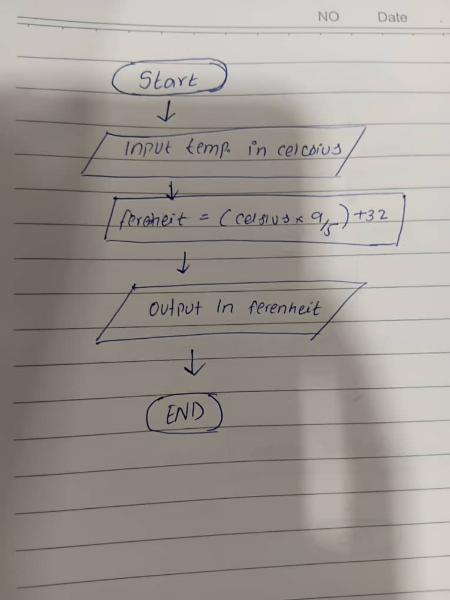

# Convert Celsius to Fahrenheit
## Flowchart :


This is a simple algorithm to convert a temperature from Celsius to Fahrenheit. The algorithm is written in pseudocode and is intended to be easy to understand and follow.

## Algorithm Steps
1. **Input** the temperature in Celsius
2. **Calculate** the temperature in Fahrenheit using the formula: Fahrenheit = (Celsius × 1.8) + 32
3. **Output** the temperature in Fahrenheit

---

## Pseudocode
```pseudo
INPUT Celsius
Fahrenheit = (Celsius * 1.8) + 32
OUTPUT Fahrenheit
```

---

> **End of the pseudocode algorithm**
