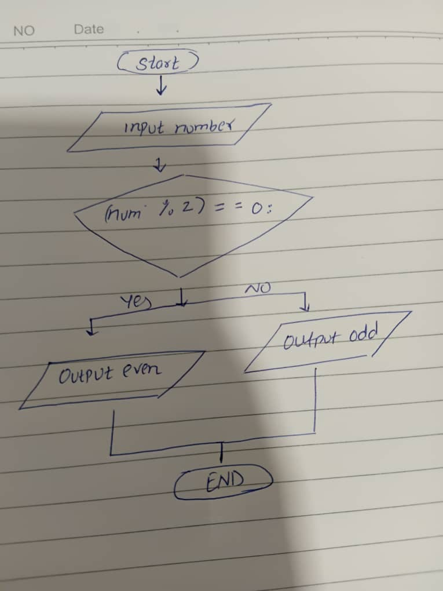

# Check if a Number is Even or Odd
## Flowchart :


This is a simple algorithm to check if a number is even or odd. The algorithm is written in pseudocode and is intended to be easy to understand and follow.

## Algorithm Steps
1. **Input** a number
2. **Check** if the number is even or odd by finding the remainder when divided by 2
3. **Output** whether the number is even or odd

---

## Pseudocode
```pseudo
INPUT number
IF number MOD 2 = 0 THEN
    OUTPUT "The number is even."
ELSE
    OUTPUT "The number is odd."
ENDIF
```

---

> **End of the pseudocode algorithm**